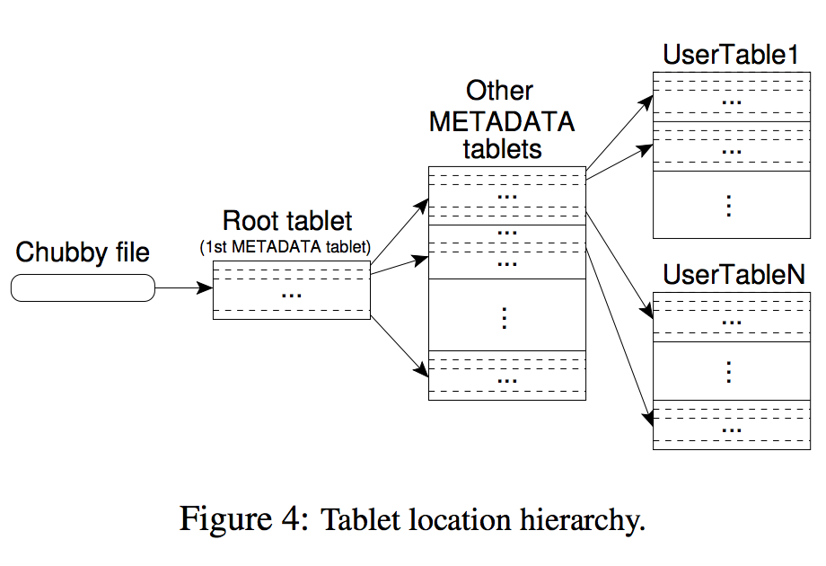
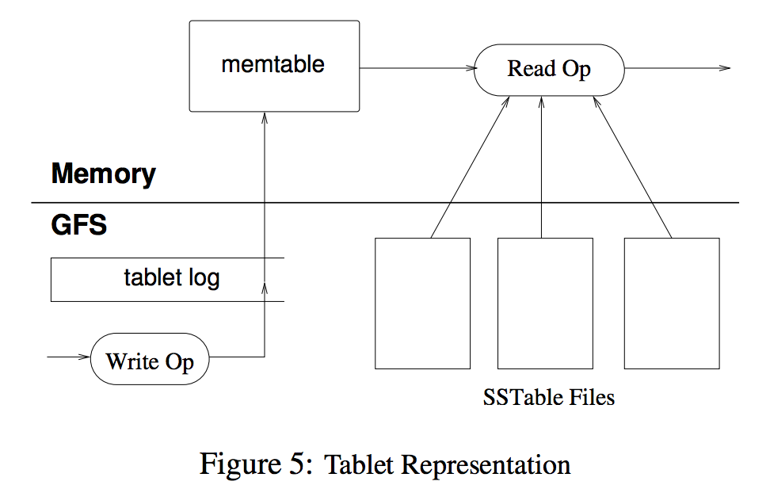

Bigtable is a **distributed** storage system for managing **structured** data.

Design goals are **wide applicability**, **scalability**, **high performance**,
and **high availability**.

## Data model

A Bigtable is a sparse, distributed, persistent multidimensional
sorted map. The map is indexed by a **row key**, **column key**, and
a **timestamp**. each value in the map
is an uninterpreted array of bytes.

```
(row:string, column:string, time:int64) → string
```

### rows

Every read or write of data under a single row key is **atomic** (regardless of
the number of different columns being read or written in the row), a design
decision that makes it easier for clients to reason about the system’s behavior
in the presence of concurrent
updates to the same row.

Bigtable maintains data in **lexicographic order** by row
key. The row range for a table is dynamically partitioned.
Each row range is called a **tablet**, which is the unit of distribution
and load balancing. As a result, reads of short
row ranges are efficient and typically require communication
with only a small number of machines. Clients
can exploit this property by selecting their row keys so
that they get **good locality** for their data accesses.

### column families

Column keys are grouped into sets called column families,
which form the **basic unit of access control**. All data
stored in a column family is usually of the same type (we
compress data in the same column family together).

A column family must be created before data can be stored
under any column key in that family; after a family has
been created, any column key within the family can be
used.

Usually have small numbers of column family, but the number of columns can vary.

A column key is named using the following syntax: ```family:qualifier```.

### timestamp

Each cell in a Bigtable can contain multiple versions of
the same data; these versions are indexed by timestamp.
Bigtable timestamps are 64-bit integers.

Different versions of a cell are stored in **decreasing timestamp order**,
so that the most recent versions can be read first.

The client can specify either that only the last n versions
of a cell be kept, or that only new-enough versions be
kept (e.g., only keep values that were written in the last
seven days).

## dependencies

### GFS

Bigtable uses the distributed Google File System (GFS) to store log and data
files.   

The Google SSTable file format is used internally to store Bigtable data. An
SSTable provides a persistent, ordered immutable map from keys to values, where
both keys and values are arbitrary byte strings.

Each SSTable contains a sequence of blocks (typically each block is 64KB in
size, but this is configurable). A block index (stored at the end of the
SSTable) is used to locate blocks; the index is loaded
into memory when the SSTable is opened. A lookup can be performed with a single
disk seek: we first find the appropriate block by performing a binary search in
the in-memory index, and then reading the appropriate block from disk.

### chubby

Bigtable relies on a highly-available and persistent
distributed lock service called Chubby.

Bigtable uses Chubby for a variety of tasks:    
to ensure that there is at most one active master at any time; to
store the bootstrap location of Bigtable data ; to discover tablet servers and
finalize tablet server deaths; to store Bigtable schema
information (the column family information for each table);
and to store access control lists. If Chubby becomes
unavailable for an extended period of time, Bigtable becomes
unavailable. 

## implementation 

The Bigtable implementation has three major components:
a **library** that is linked into every client, one **master server**, and
**many tablet servers**.

The **master** is responsible for assigning tablets to tablet servers, detecting
the addition and expiration of tablet servers, balancing tablet-server load, and
garbage collection of files in GFS. In addition, it handles schema changes such
as table and column family creations. Each tablet server manages a set of
tablets (typically we have somewhere between ten to a thousand tablets per
tablet server). 

The **tablet server** handles read and write requests to the tablets that it has
loaded, and also splits tablets that have grown too large.

As with many single-master distributed storage systems, client data **does not
move through the master**: clients communicate directly with tablet servers for
reads and writes. Because Bigtable clients do not rely on the master for tablet
location information, most clients
never communicate with the master. As a result, the master
is lightly loaded in practice.

A Bigtable cluster stores a number of tables. Each table consists of a set of
tablets, and each tablet contains all data associated with a row range.
Initially, each table consists of just one tablet. As a table grows, it is
automatically split into multiple tablets, each approximately 100-200 MB in size
by default.

### tablet location



We use a three-level hierarchy analogous to that of a B+ tree to store tablet
location information.

The first level is a file stored in Chubby that contains the location of the
root tablet. 

The METADATA table stores the location of a tablet under a row key that is an
encoding of the tablet’s table identifier and its end row.

### tablet assignment 

Each tablet is assigned to one tablet server at a time. The master keeps track
of the set of live tablet servers, and the current assignment of tablets to
tablet servers, including
which tablets are unassigned. When a tablet is unassigned, and a tablet server
with sufficient room for the tablet is available, the master assigns the tablet
by sending a tablet load request to the tablet server.

(1) The master grabs a unique master lock in Chubby, which prevents concurrent
master instantiations.   
(2) The master scans the servers directory in Chubby to find the live servers.  
(3) The master communicates with every live tablet server to discover what
tablets are already assigned to each server. 
(4) The master scans the METADATA table to learn the set of tablets. Whenever
this scan encounters a tablet that is not already assigned, the master adds the
tablet to the set of unassigned tablets, which makes the tablet eligible for
tablet assignment.

### tablet serving  


Write: commit log(redo log) and memtable
Read: merge view of memtable and sstable

### compaction
When the memtable size reaches a threshold, the memtable is frozen, a new
memtable is created, and the frozen memtable is converted to an SSTable and
written to GFS. 
This **minor compaction** process has two goals:

+   it shrinks the memory usage of the tablet server
+   it reduces the amount of data that has to be read from the commit log during
recovery if this server dies.

A **merging compaction** reads the contents of a few SSTables and the memtable,
and writes out a new SSTable. The input SSTables and memtable can be discarded
as soon as the compaction has finished.

A merging compaction that rewrites all SSTables into exactly one SSTable is
called a **major compaction**. SSTables produced by non-major compactions can
contain special deletion entries that suppress deleted data in older SSTables
that are still live. A major compaction,
on the other hand, produces an SSTable that contains **no deletion information
or deleted data**.

## Refinements
### locality groups
Clients can group multiple column families together into a locality group.
A separate SSTable is generated for each locality group in each tablet.
Segregating column families that are not typically accessed together into
separate locality groups enables more efficient reads

### compaction
Client can control whether sstables are compacted and which compression format
is used. The user-specified compression
format is applied to each SSTable block, Although we lose some space by
compressing each block separately, we benefit in that small portions of an
SSTable can be read without decompressing
the entire file. 

### bloom filter
We reduce the number of accesses by allowing clients to specify that Bloom
filters should be created for SSTables in a particular
locality group. A Bloom filter allows us to ask whether an SSTable might contain
any data for a specified row/column pair.

### commit log
append mutations to a single commit log per tablet server, co-mingling mutations
for different tablets in the same physical log
file.
> Written with [StackEdit](https://stackedit.io/).
