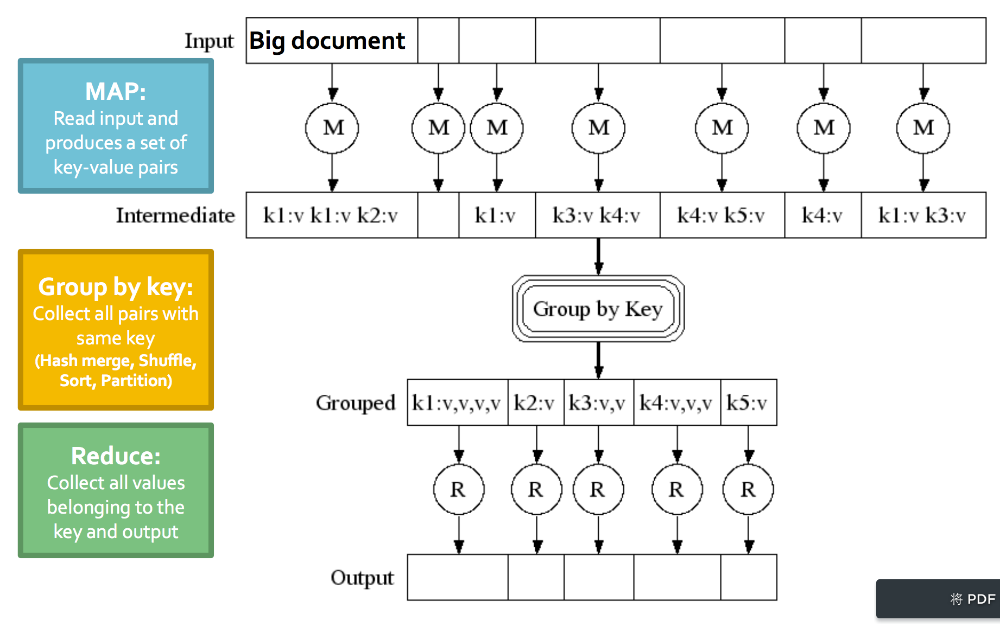

### cluster computation challenges
 
+   Node failures
    
    A   single  server  can stay    up  for 3   years   (1000   days);
    1000    servers in  cluster =>  1   failure/day

    如果节点挂掉，如何持久化数据？如何处理节点正在进行的运算？

+   Network bottleneck

    数据太大，网络传输耗时

+   Distributing programming is hard

    分布式编程很困难，复杂度高

### How map reduce framework handle this challenges?

+   Store data redundantly on multiple nodes 
+   Move computation close to data
+   Simple programming model

####  Redundant storage(distribute file system, GFS, HDFS)

**Usage patterns**

+   Huge files
+   Data is rarely updated in   place
+   Reads and appends are common

**DFS architecture**

+   Chunk servers
Data kept   in "chunks" spread across machines, each chunk replicated   on
different   machines    

+   Master server
store meta data about file system

+   client library
1) talk to master to find chunk server;
2) connect chunk server to access data.

#### map reduce model

**Map-Reduce environment responsibilities**

+ Partioning the input data
+ Scheduling the program’s execution across a set of machines
+ Performing the group by key step
+ Handling node failures
+ Managing required inter-machin communication

**data flow**

+   Input and final output are stored on the
distributed file system (DFS):
    Scheduler tries to schedule map tasks "close" to physical storage location
of input data
+   Intermediate results are stored on local FS of Map and Reduce workers
+   Output is often input to another MapReduce task

#####Master

**Master node takes care of coordination**

+   Task status: (idle, in-progress, completed)
+   Idle tasks get scheduled as workers become available 
+   When a map task completes, it sends the master
the location and sizes of its R intermediate files,
one for each reducer
+   Master pushes this info to reducers

**Master    pings workers   periodically    to  detect  failures**

+   Map worker failure
map tasks completed or in-progress at worker are reset to idle and rescheduled

+   Reduce worker failure
only in-progress tasks are reset to idle and rescheduled.

+   Master failure
MapReduce   task    is  aborted and client is notified

**How many map and reduce jobs?**

make the number of map jobs much larger than the number of nodes, one chunk
a map is common;
improve dynamic load    balancing and speeds    up recovery from    worker
failures    

the number of reduce jobs is smaller than maps', because every reduce job
produce an output file.

##### Combiners

combiners is **usually** same as reduce function, combines the values of all
keys of a single mapper.Much less data needs to be copied and shuffled.

combiner trick works only if reduce function is communicative and associative.

##### Partition Function

Partition function determines the set of keys that go to a single reduce worker

System uses a default partition function: **hash(key) mode R**

Sometimes is useful to override: eg, **hash(hostname(url)) mode R**

> Written with [StackEdit](https://stackedit.io/).
