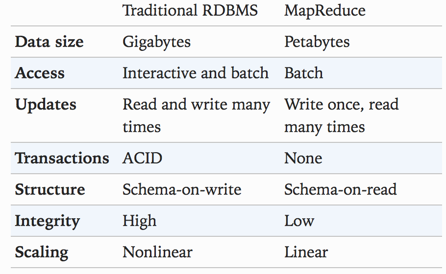
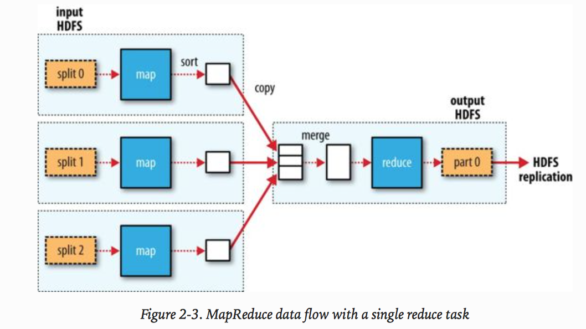
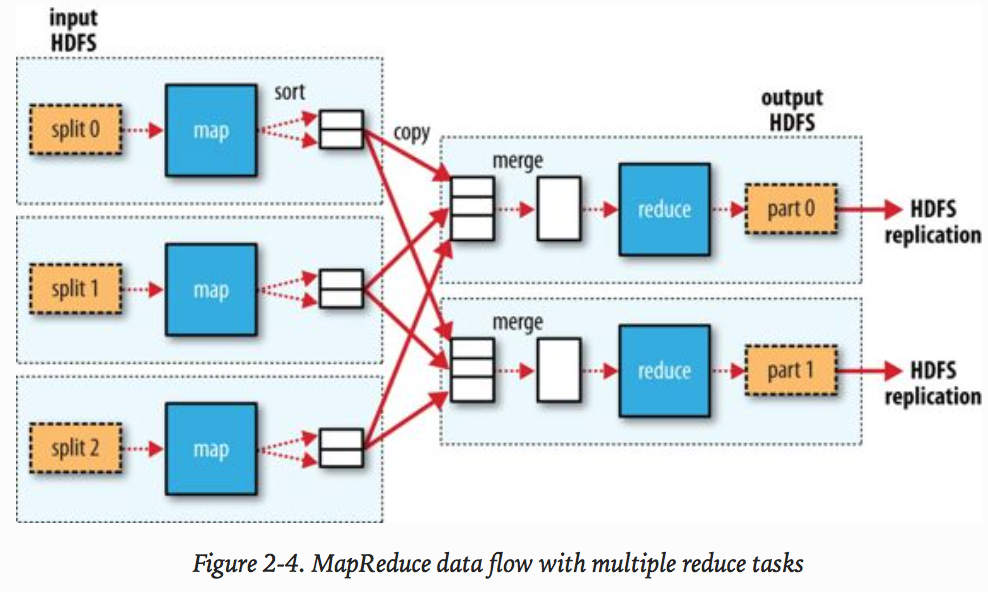

# MapReduce

## RDBMS compare to MapReduce

## Data flow 

When there are multiple reducers, the map tasks partition their output, each
creating one partition for each reduce task.      

There can be many keys (and their
associated values) in each partition, but the records for any given key are all
in a single partition. 

The partitioning can be controlled by a user-defined
partitioning function, but normally the default partitioner — which buckets keys
using a hash function — works very well.

## Combiner Functions

Many MapReduce jobs are limited by the bandwidth available on the cluster, so it pays to minimize the data transferred between map and reduce tasks. Hadoop allows the user to specify a combiner function to be run on the map output, and the combiner function’s output forms the input to the reduce function. Because the combiner function is an optimization, Hadoop does not provide a guarantee of how many times it will call it for a particular map output record, if at all. In other words, calling the combiner function zero, one, or many times should produce the same output from the reducer.