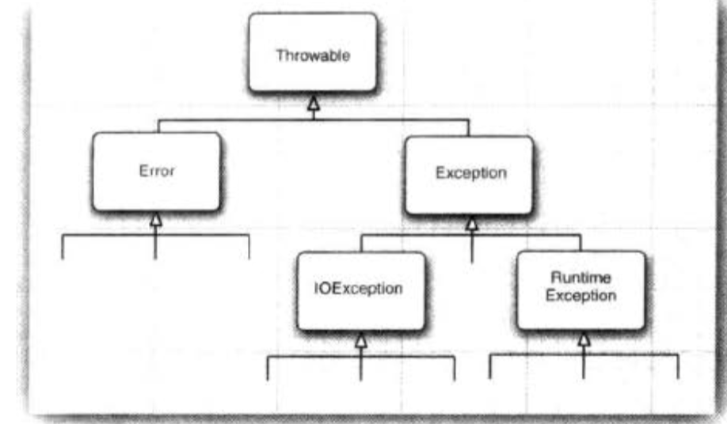

## The Classification of Exceptions  

### Error  
The **Error** hierarchy describes internal errors and resource exhaustion situations inside the Java runtime system. You
should not throw an object of this type. There is little you can do if such an internal error occurs, beyond notifying 
the user and trying to terminate the program gracefully.

### Exception 
The Exception hierarchy splits into two branches: exceptions that derive from **RuntimeException** and those that do not.
The general rule is this: A **RuntimeException** happens because you made a programming error. Any other exceptions 
occurs because a bad thing, such as an I/O error, happened to your otherwise good program. If it is a RuntimeException, 
it was your fault. 

### checked exception and unchecked exception 
The Java Language Specification calls any exception that derives from the class **Error** or the class **RuntimeException** 
an **unchecked** exception. All other exceptions are called **checked exceptions**. The compiler checks that you provide 
exception handlers for all checked exceptions.  

A method must declare all the **checked exceptions** that it might throw. Unchecked exceptions are either beyond your 
control (Error) or result from conditions that you should not have allowed in the first place(RuntimeException). Instead 
of declaring the exception, you can also catch it. Then the exception won't be thrown out of the method, and no throws 
specification is necessary. 

If you override a method from a superclass, the checked exceptions that the subclass method declares cannot be more general 
than those of 