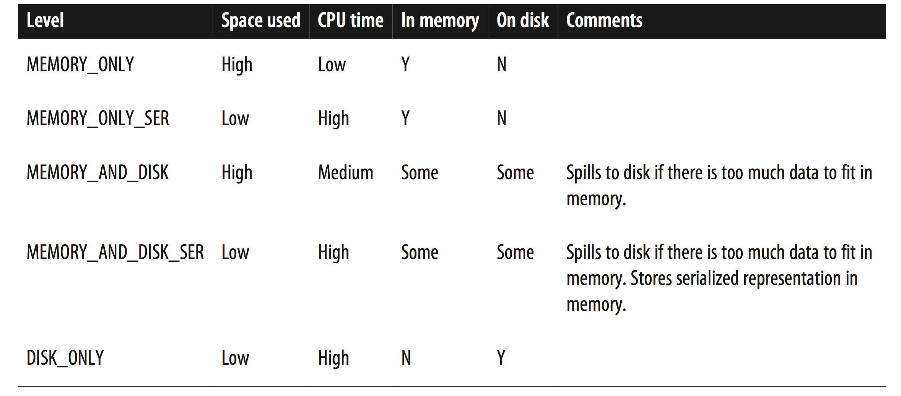

## RDD Basics  
An RDD in Spark is simply an immutable distributed collection of objects. Each
RDD is split into multiple partitions, which may be computed on different nodes
of the cluster. 

### Transformations and Actions  
RDDs offers two types of operations: **transformations** and **actions**. 

## Creating Rdds   
Spark provides two ways to create RDDS: loading an external dataset and
parallelizing a collection in your driver program.   
parallelizing a collection is not widely used since it requires that you have
your entire dataset in memory on one machine.


## Rdd operations

### Transformations  
Transformations are operations on RDDs that return a new RDD.
transformed RDDs are computed lazily, only when you use them in an action.  
Many transformations are **element-wise**; that is, they work on one element at
a time; but this is not true for all transformations.  
Spark keeps track of the set of dependencies between different RDDs, called the
**lineage graph**.It uses this information to compute each RDD on demand and to
recover lost data if part of a persistent RDD is lost. 

**lazy evaluation**   
Rather than thinking of an RDD as containing specific data, it is best to think
of each RDD as consisting of instructions on how to compute the data that we
build up through transformations. Loading data into an RDD is lazily evaluated
in the same way transformations are. So, when we call sc.textFile(), the data
is not loaded until it is necessary. As with transformations, the operation
(in this case, reading the data) can occur multiple times.  
Spark uses lazy evaluation to reduce the number of passes it has to take over
our data by grouping operations together. In systems like Hadoop MapReduce,
developers often have to spend a lot of time considering how to group together
operations to minimize the number of MapReduce passes. **In Spark, there is no
substantial benefit to writing a single complex map instead of chaining together
many simple operations**. 

### Actions  
They are the operations that return a final value to the driver program or write
data to an external storage system. Actions force the evaluation of the
transformations required for the RDD they were called on, since they need to
actually produce output.   

## Passing Functions to Spark  
### Python
When you pass a function that is the member of an object, or contains references
to fields in an object (e.g., self.field), Spark sends the entire object to
worker nodes, which can be much larger than the bit of information you need. 
Sometimes this can also cause your program to fail, if your class
contains objects that Python can’t figure out how to pickle.

### Scala   
The function we pass and the data referenced in it needs to be serializable
(implementing Java’s Serializable interface). Furthermore, as in Python, passing
a method or field of an object includes a reference to that whole object, though
this is less obvious because we are not forced to write these references with
**self**.

### Java  
In Java, functions are specified as objects that implement one of Spark’s
function interfaces from the ```org.apache.spark.api.java.function``` package. There
are a number of different interfaces based on the return type of the function.


## Common Transformations and Actions   
### Transformations  
#### Basic RDD transformations   
```map``` ```flatMap```  ```filter```  ```distinct```   ```sample```
#### Two-RDD transformations   
```union```  ```intersection```  ```subtract```  ```cartesian```    
```union``` and ```subtract``` may have dumplicate elements, ```intersection```
remove duplicate.

### Actions   
+   fold   
Aggregate the elements of each partition, and then the results for all the
partitions, using a given associative and commutative function and a neutral
"zero value". The function ```op(t1, t2)``` is allowed to modify t1 and return it as
its result value to avoid object allocation; however, it should not modify t2.

+   aggregate  
The aggregate() function frees us from the constraint of having the return be
the same type as the RDD we are working on.  
Aggregate the elements of each partition, and then the results for all the
partitions, using given combine functions and a neutral "zero value".

+   collect  
Keep in mind that your entire dataset must fit in memory on a single machine to
use collect() on it, so collect() shouldn’t be used on large datasets.

+   saveAsTextFile saveAsSequenceFile  
In most cases RDDs can’t just be collect()ed to the driver because they are too
large. In these cases, it’s common to write data out to a distributed storage
system such as HDFS or Amazon S3. You can save the contents of an RDD using the
saveAsTextFile() action, saveAsSequenceFile(), or any of a number of actions for
various built-in formats. 

### Converting Between RDD Types  
#### Scala  
In Scala the conversion to RDDs with special functions (e.g., to expose numeric
func‐ tions on an RDD[Double]) is handled automatically using implicit conversions.     
### Python   
In Python all of the functions are implemented on the base RDD class but will
fail at runtime if the type of data in the RDD is incorrect.


## Persistence(Caching)   
In Scala and Java, the default persist() will store the data in
the JVM heap as unserialized objects. In Python, we always serialize the data
that persist stores, so the default is instead stored in the JVM heap as pickled
objects. When we write data out to disk or off-heap storage, that data is also
always serialized.    


If you attempt to cache too much data to fit in memory, Spark will automatically
evict old partitions using a Least Recently Used (LRU) cache policy. For the
memory- only storage levels, it will recompute these partitions the next time
they are accessed, while for the memory-and-disk ones, it will write them out to
disk. In either case, this means that you don’t have to worry about your job
breaking if you ask Spark to cache too much data. However, caching unnecessary
data can lead to eviction of useful data and more recomputation time.
Finally, RDDs come with a method called unpersist() that lets you manually
remove them from the cache.
