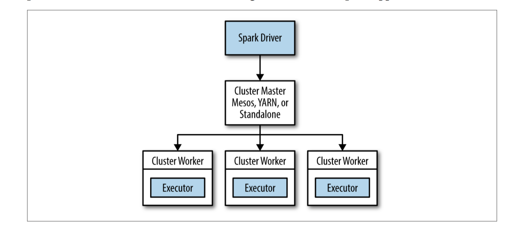

## Spark Runtime Architecture

### Spark Application  
Spark uses a master/slave architecture with one central coordinator and many
distributed workers. The central coordinator is called the **driver**.    
The driver communicates with a potentially large number of distributed workers called
executors.

The driver runs in its own Java process and each executor is a separate Java
process. A driver and its executors are together termed a **Spark application**

A Spark application is launched on a set of machines using an external service
called a cluster manager.

####   the Driver  
The driver is the process where the main() method of your program runs. It is
the process running the user code that creates a SparkContext, creates RDDs, and
performs transformations and actions. When you launch a Spark shell, you’ve
created a driver program. Once the driver terminates, the application is
finished.

The duties of the driver:   

+   Converting a user program into tasks  

    A Spark program implicitly creates a logical directed acyclic graph (DAG) of operations.   
    When the driver runs, it converts this logical graph into a physical execution plan.  
    Spark performs several optimizations, such as “pipelining” map transformations
    together to merge them, and converts the execution graph into a set of **stages**.    
    Each stage, in turn, consists of multiple **tasks**. The tasks are bundled up and
    prepared to be sent to the cluster. Tasks are the smallest unit of work in
    Spark; a typical user program can launch hundreds or thousands of individual
    tasks.
    
+   Scheduling tasks on executors   
    Given a physical execution plan, a Spark driver must coordinate the scheduling of individual tasks on executors.   
    When executors are started they register themselves with the driver, so it has a complete view of the application’s executors at all times.     
    Each executor represents a process capable of running tasks and storing RDD data.        
    The Spark driver will look at the current set of executors and try to schedule each task in an appropriate location, based on data placement. 
    When tasks execute, they may have a side effect of storing cached data. 
    The driver also tracks the location of cached data and uses it to schedule future tasks that access that data.

#### the Executors   
Spark executors are worker processes responsible for running the individual tasks in a given Spark job.    
Executors are launched once at the beginning of a Spark application and typically run for the entire lifetime of an
application, though Spark applications can continue if executors fail.

+   Run tasks   
    they run the tasks that make up the application and return results to the driver. 

+   Storage and Cache  
    they provide in-memory storage for RDDs that are cached by user programs, through a service called the Block Manager that lives within each executor.  
    Because RDDs are cached directly inside of executors, tasks can run alongside the cached data.

### Cluster Manager   

StandAlone, YARN, Mexos

### Steps occur when run application on a cluster  
+   The user submits an application using spark-submit.  
+   spark-submit launches the driver program and invokes the main() method specified by the user.   
+   The driver program contacts the cluster manager to ask for resources to launch executors.   
+   The cluster manager launches executors on behalf of the driver program.   
+   The driver process runs through the user application. Based on the RDD actions and transformations in the program, the driver sends work to executors
in the form of tasks.    
+   Tasks are run on executor processes to compute and save results.    
+   If the driver’s main() method exits or it calls SparkContext.stop(), it will terminate the executors and release resources from the cluster manager.
